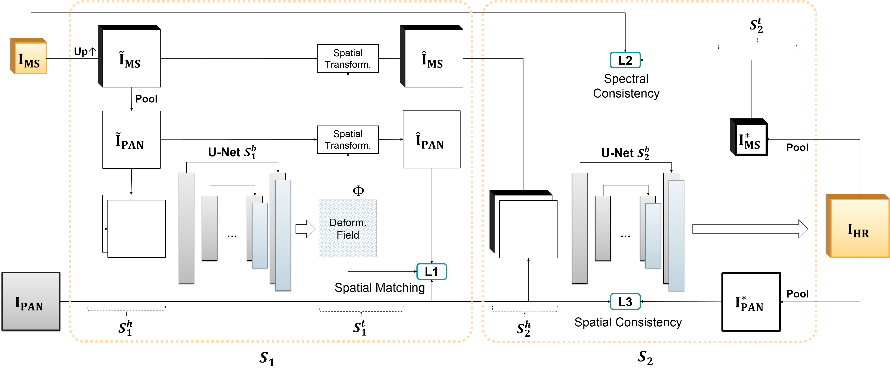

# W-NetPan: Double-U Network for Inter-sensor Self-supervised Pan-sharpening

[Ruben Fernandez-Beltran](https://scholar.google.es/citations?user=pdzJmcQAAAAJ&hl=es), [Rafael Fernandez](https://ieeexplore.ieee.org/author/37088757738), [Jian Kang](https://github.com/jiankang1991), [Filiberto Pla](https://scholar.google.es/citations?user=mSSPcAMAAAAJ&hl=es)
---

This repo contains the codes for the paper: [W-NetPan: Double-U Network for Inter-sensor Self-supervised Pan-sharpening](https://www.sciencedirect.com/science/article/pii/S0925231223001339). The increasing availability of remote sensing data allows dealing with spatial-spectral limitations by means of pan-sharpening methods. However, fusing inter-sensor data poses important challenges, in terms of resolution differences, sensor-dependent deformations and ground-truth data availability, that demand more accurate pan-sharpening solutions. In response, this paper proposes a novel deep learning-based pan-sharpening model which is termed as the double-U network for self-supervised pan-sharpening (W-NetPan). In more details, the proposed architecture adopts an innovative W-shape that integrates two U-Net segments which sequentially work for spatially matching and fusing inter-sensor multi-modal data. In this way, a synergic effect is produced where the first segment resolves inter-sensor deviations while stimulating the second one to achieve a more accurate data fusion. Additionally, a joint loss formulation is proposed for effectively training the proposed model without external data supervision. The experimental comparison, conducted over four coupled Sentinel-2 and Sentinel-3 datasets, reveals the advantages of W-NetPan with respect to several of the most important state-of-the-art pan-sharpening methods available in the literature.





## Usage

(comming soon)

<!-- `./codes/create_model_regression.m` is the proposed 3D-CNN. -->

<!-- `./codes/RUN_3dcnn.m` is a sample of the main script. -->


## Citation

```
@article{fernandez2023w,
  title={W-NetPan: Double-U network for inter-sensor self-supervised pan-sharpening},
  author={Fernandez-Beltran, Ruben and Fernandez, Rafael and Kang, Jian and Pla, Filiberto},
  journal={Neurocomputing},
  volume={530},
  pages={125--138},
  year={2023},
  publisher={Elsevier}
}
```


## References

[1] Javan, F. D., Samadzadegan, F., Mehravar, S., Toosi, A., Khatami, R., & Stein, A. (2021). A review of image fusion techniques for pan-sharpening of high-resolution satellite imagery. ISPRS journal of photogrammetry and remote sensing, 171, 101-117.

[2] Ronneberger, O., Fischer, P., & Brox, T. (2015). U-net: Convolutional networks for biomedical image segmentation. In Medical Image Computing and Computer-Assisted Intervention–MICCAI 2015: 18th International Conference, Munich, Germany, October 5-9, 2015, Proceedings, Part III 18 (pp. 234-241). Springer International Publishing.
